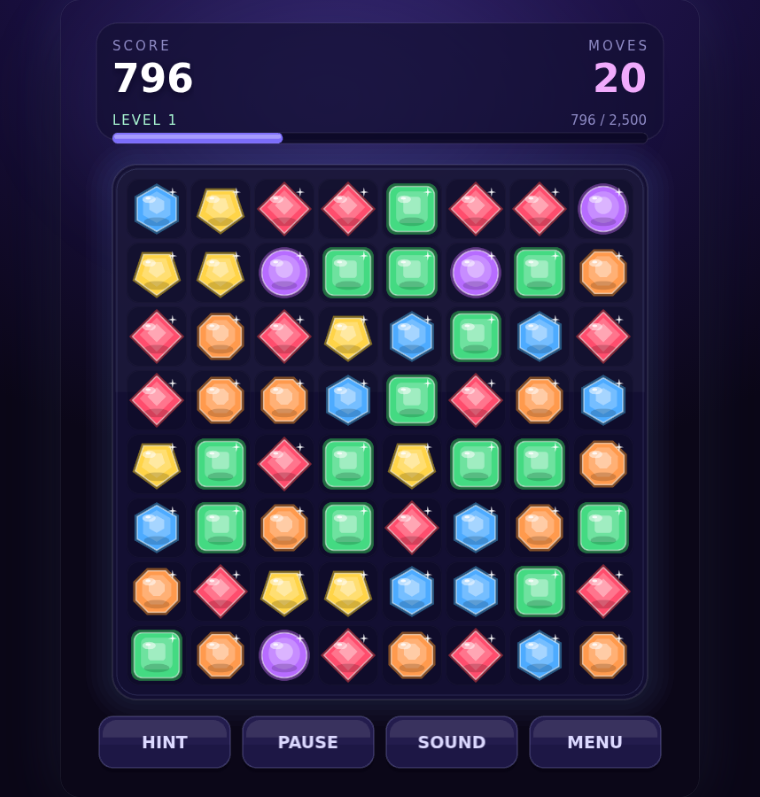

# GEMFALL 💎

A match-3 gem game I made for fun. Swap gems, set off chain reactions, blow stuff up.

### ▶ Play it: **<https://gemfall.moopit.fun>**

It runs in your browser on a phone, tablet or computer. No install, no account, no ads.



## How to play

Swap two gems that are next to each other so that **3 or more of the same colour** line up.
They explode, the gems above fall down, and any new lines they make explode too. That chain
reaction is where the big scores come from.

- **Tap** a gem, then tap its neighbour. Or just **swipe** a gem toward the one you want to swap.
- A swap that makes no match slides back, and it doesn't cost you a move.
- Stuck? Press **HINT**. The game also nudges you if you sit still for a while.
- Out of moves? The board reshuffles itself without costing you a move. In **Endless** you
  get 3 shuffles, and the game ends when you run out of moves with none left.

### Power gems

Make bigger matches to get special gems. Match a special gem to set it off.

| Match | You get | When it goes off |
|---|---|---|
| 4 in a row | **Line blaster** | Clears its whole row or column |
| An L or T shape | **Bomb** | Clears everything around it |
| 5 in a row | **Hypercube** (the rainbow one) | Swap it with any gem to clear every gem of that colour |

### Modes

| Mode | Rules |
|---|---|
| **Endless** | No clock and no move limit: chase the high score until you run out of shuffles |
| **Timed** | Score as much as you can in 60 seconds |
| **Moves** | You get 30 moves |

**Easy** has a small board with fewer colours. **Hard** adds a seventh colour, which makes
matches rarer. Every mode and difficulty keeps its own high score.

### On a computer

| Key | Does |
|---|---|
| Arrow keys, then Enter | Move around the board and swap |
| `H` or Space | Hint |
| `P` or Esc | Pause |
| `M` | Sound on/off |
| `R` | Restart |

## Good to know

- **Your scores stay on your device.** High scores and your unfinished game are saved in your
  browser. Nothing gets sent anywhere. Clearing your browser data wipes them.
- **The game pauses itself** when you switch apps or tabs. Tap **RESUME** to carry on.
- **Phone buzz** only works in **Chrome on Android** (and browsers built on it, like Samsung
  Internet). iPhones and Firefox can't do it. Turn it on or off with **BUZZ** on the menu.
  Hold **HOLD TO TEST** to check your phone. The line at the bottom of the menu shows what the
  browser said.
- **Sound** is made by the game as you play (there are no audio files). The **SOUND** button
  turns it off.

## Known issues

- **Phone buzz isn't working yet** on some Android phones, even in Chrome. I'm looking into it.
  If yours buzzes during **HOLD TO TEST** but not when gems explode, please tell me.

## Found a bug?

Tell Daniel. The small text at the very bottom of the menu (for example `v0.2.0 · 7d40db0`) says
exactly which version you have, so include it along with what phone or browser you were using.

---

## For the curious

Everything here is original: the gems, board, buttons and sounds are all drawn and generated
by code, and no art or code comes from the real Bejeweled. It's built with
[Phaser 3](https://phaser.io), [Vite](https://vite.dev) and TypeScript.

| If you want to… | Read |
|---|---|
| Run it yourself or change it | [docs/DEVELOPING.md](docs/DEVELOPING.md) |
| Know how it gets online | [docs/DEPLOYING.md](docs/DEPLOYING.md) |
| See what changed and when | [CHANGELOG.md](CHANGELOG.md) |
| Read the original design | [bejeweled-spec.md](bejeweled-spec.md) |

Quick start:

```bash
npm install
npm run dev     # http://localhost:4770
```
